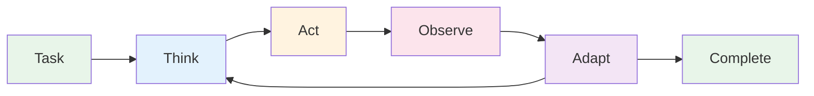

# What Actually Happens When You Type in Claude Code? Understanding Agent Loops

## Table of Contents

- [The Multi-Step Mystery](#the-multi-step-mystery)
- [Following the Trail](#following-the-trail)
- [The Agent Loop Pattern](#the-agent-loop-pattern)
- [Anatomy of an Agent Loop](#anatomy-of-an-agent-loop)
- [Tools: How Agents Touch Your Code](#tools-how-agents-touch-your-code)
- [Building Our Own Agent](#building-our-own-agent)
- [The Architecture Spectrum](#the-architecture-spectrum)
- [Practical Insights for Engineers](#practical-insights-for-engineers)
- [Where We're Headed](#where-were-headed)

## The Multi-Step Mystery

Yesterday I watched Claude Code refactor a complex authentication system. It found all the auth endpoints across 15 files, understood the token validation flow, identified security vulnerabilities, fixed them consistently, and even updated the tests. The entire process took 47 steps and felt eerily like pair programming with a senior engineer.

How does an AI model—which fundamentally just predicts the next token—orchestrate such complex multi-step workflows?

**The answer is agent loops**, and once you understand this pattern, you'll see it's both simpler and more powerful than you might expect.

## Following the Trail

Let's trace what actually happens when you give Claude Code a complex task:

```typescript
// You: "Find all API endpoints that don't have rate limiting and add it"

// Here's what Claude Code actually does:

// First, it thinks: "I need to find API endpoint files"
// Then executes: search for route definitions
// Observes: 23 files with Express routes
// Thinks: "I should check which ones already have rate limiting"
// Executes: read the first file
// Observes: No rate limiting middleware
// Thinks: "I need to see if there's an existing rate limiter"
// Executes: search for rate limit configuration
// Observes: Found middleware/rateLimiter.js
// Thinks: "Now I can add this to endpoints that need it"
// ... continues for all 23 files
```

What you're seeing is an **agent loop** in action—a system that can think, act, observe, and adapt based on what it discovers. It's not magic; it's a well-designed pattern that gives AI the ability to work iteratively, just like we do.

## The Agent Loop Pattern

At its core, an agent loop is beautifully simple:



**The key components:**

1. **Think**: The LLM analyzes the current situation and decides what to do next
2. **Act**: Execute a tool (read file, search code, run command)
3. **Observe**: Capture the result of that action
4. **Adapt**: Update understanding based on what was learned
5. **Repeat**: Continue until the task is complete

This creates a feedback loop where each action informs the next decision. The AI doesn't need to plan everything upfront—it can explore, learn, and adjust its approach based on what it finds.

## Anatomy of an Agent Loop

Let's look at the actual implementation pattern:

```typescript
interface AgentLoop {
  llm: LanguageModel;
  tools: Tool[];
  maxSteps: number;
}

async function runAgentLoop(task: string, options: AgentLoop) {
  const context: Message[] = [
    { role: 'user', content: task }
  ];
  
  for (let step = 0; step < options.maxSteps; step++) {
    // THINK: LLM decides next action
    const decision = await options.llm.complete({
      messages: context,
      tools: options.tools,
    });
    
    // Check if task is complete
    if (decision.type === 'final_answer') {
      return decision.content;
    }
    
    // ACT: Execute the chosen tool
    const toolResult = await executeToolSafely(
      decision.tool,
      decision.parameters
    );
    
    // OBSERVE & ADAPT: Add result to context
    context.push({
      role: 'assistant',
      content: decision.reasoning,
      tool_use: decision.tool,
    });
    
    context.push({
      role: 'tool',
      content: toolResult,
    });
  }
  
  throw new Error('Max steps reached');
}
```

**Critical design decisions:**

- **Stateful context**: Each tool result is added to the conversation
- **Step limits**: Prevent infinite loops
- **Error handling**: Tools can fail, and that's useful information
- **Clear separation**: The LLM thinks, tools act

## Tools: How Agents Touch Your Code

Tools are the bridge between AI intelligence and real-world actions. They're surprisingly simple:

```typescript
interface Tool {
  name: string;
  description: string;
  parameters: JsonSchema;
  execute: (params: any) => Promise<any>;
}

// Example: File reading tool
const readFileTool: Tool = {
  name: 'read_file',
  description: 'Read the contents of a file',
  parameters: {
    type: 'object',
    properties: {
      path: { type: 'string', description: 'File path to read' }
    },
    required: ['path']
  },
  execute: async ({ path }) => {
    try {
      return await fs.readFile(path, 'utf-8');
    } catch (error) {
      return `Error reading ${path}: ${error.message}`;
    }
  }
};
```

**Common tool categories in coding assistants:**

### Discovery Tools
Help the agent understand your codebase:
- `search_files`: Find files matching patterns
- `grep_content`: Search for code patterns
- `list_directory`: Explore project structure

### Analysis Tools
Extract information and understanding:
- `read_file`: Get file contents
- `get_diagnostics`: Language server errors/warnings
- `parse_ast`: Understand code structure

### Modification Tools
Make changes to code:
- `write_file`: Update file contents
- `apply_diff`: Precise code modifications
- `refactor`: Automated refactoring operations

### Validation Tools
Ensure changes are correct:
- `run_tests`: Execute test suites
- `type_check`: Run TypeScript/Flow/etc
- `lint`: Check code style
- `build`: Compile the project

**The power emerges from composition.** An agent might use search to find test files, read to understand test patterns, write to add new tests, and run_tests to verify they pass—all in a single task.

## Building Our Own Agent

Let's implement a minimal agent to understand the mechanics:

```typescript
import { Anthropic } from '@anthropic-ai/sdk';
import * as fs from 'fs/promises';
import { exec } from 'child_process';
import { promisify } from 'util';

const execAsync = promisify(exec);

// Define our tool interface
interface Tool {
  name: string;
  description: string;
  input_schema: any;
}

// Basic file system tools
const tools: Tool[] = [
  {
    name: 'read_file',
    description: 'Read a file from the filesystem',
    input_schema: {
      type: 'object',
      properties: {
        path: { type: 'string' }
      },
      required: ['path']
    }
  },
  {
    name: 'write_file',
    description: 'Write content to a file',
    input_schema: {
      type: 'object',
      properties: {
        path: { type: 'string' },
        content: { type: 'string' }
      },
      required: ['path', 'content']
    }
  },
  {
    name: 'search_files',
    description: 'Search for files using grep',
    input_schema: {
      type: 'object',
      properties: {
        pattern: { type: 'string' },
        path: { type: 'string', default: '.' }
      },
      required: ['pattern']
    }
  },
  {
    name: 'run_command',
    description: 'Execute a shell command',
    input_schema: {
      type: 'object',
      properties: {
        command: { type: 'string' }
      },
      required: ['command']
    }
  }
];

// Tool execution
async function executeTool(toolName: string, args: any): Promise<string> {
  switch (toolName) {
    case 'read_file':
      return await fs.readFile(args.path, 'utf-8');
      
    case 'write_file':
      await fs.writeFile(args.path, args.content);
      return `Successfully wrote to ${args.path}`;
      
    case 'search_files':
      const { stdout } = await execAsync(
        `grep -r "${args.pattern}" ${args.path} --include="*.ts" --include="*.js" | head -20`
      );
      return stdout || 'No matches found';
      
    case 'run_command':
      const result = await execAsync(args.command);
      return result.stdout + (result.stderr ? '\nErrors:\n' + result.stderr : '');
      
    default:
      throw new Error(`Unknown tool: ${toolName}`);
  }
}

// The agent loop implementation
class SimpleAgent {
  private anthropic: Anthropic;
  private messages: any[] = [];
  
  constructor(apiKey: string) {
    this.anthropic = new Anthropic({ apiKey });
  }
  
  async run(task: string, maxSteps = 15): Promise<string> {
    // Initialize with the user's task
    this.messages.push({
      role: 'user',
      content: task
    });
    
    for (let step = 0; step < maxSteps; step++) {
      console.log(`\n=== Step ${step + 1} ===`);
      
      // Get the LLM's decision
      const response = await this.anthropic.messages.create({
        model: 'claude-3-sonnet-20240229',
        max_tokens: 1000,
        messages: this.messages,
        tools: tools
      });
      
      // Add response to conversation history
      this.messages.push(response);
      
      // Check if the agent wants to use a tool
      if (response.stop_reason === 'tool_use') {
        const toolUse = response.content.find(c => c.type === 'tool_use');
        
        if (toolUse) {
          console.log(`Using tool: ${toolUse.name}`);
          console.log(`Arguments:`, toolUse.input);
          
          try {
            // Execute the tool
            const result = await executeTool(toolUse.name, toolUse.input);
            console.log(`Result preview: ${result.substring(0, 200)}...`);
            
            // Add tool result to conversation
            this.messages.push({
              role: 'user',
              content: [{
                type: 'tool_result',
                tool_use_id: toolUse.id,
                content: result
              }]
            });
          } catch (error) {
            // Errors are valuable feedback
            this.messages.push({
              role: 'user',
              content: [{
                type: 'tool_result',
                tool_use_id: toolUse.id,
                is_error: true,
                content: error.message
              }]
            });
          }
        }
      } else {
        // Agent is done
        console.log('\n=== Task Complete ===');
        return response.content[0].text;
      }
    }
    
    throw new Error('Maximum steps exceeded');
  }
}

// Example usage
async function demo() {
  const agent = new SimpleAgent(process.env.ANTHROPIC_API_KEY);
  
  const result = await agent.run(
    "Find all TypeScript files that import 'axios' and list them"
  );
  
  console.log('\nFinal result:', result);
}

// Run: npm start
// === Step 1 ===
// Using tool: search_files
// Arguments: { pattern: "import.*axios", path: "." }
// Result preview: src/api/client.ts:import axios from 'axios';
// src/api/auth.ts:import axios, { AxiosError } from 'axios';
// src/services/http.ts:import axios from 'axios';...
//
// === Step 2 ===
// Using tool: run_command  
// Arguments: { command: "find . -name '*.ts' -type f | xargs grep -l 'import.*axios' | wc -l" }
// Result preview: 7
//
// === Task Complete ===
// Final result: I found 7 TypeScript files that import axios:
// 1. src/api/client.ts
// 2. src/api/auth.ts
// 3. src/services/http.ts
// ...
```

This is a complete, working agent in ~150 lines. It can explore your codebase, make changes, and run commands—the same core capabilities as commercial AI coding assistants.

## The Architecture Spectrum

While the agent loop pattern is consistent, implementations vary widely in sophistication:

### Basic Agents (Like Our Example)
- Simple tool execution
- Linear conversation history
- Basic error handling
- Limited context management

### Production Agents (Claude Code, Cursor)
- **Parallel tool execution**: Run multiple searches simultaneously
- **Smart context management**: Sliding windows, importance scoring
- **Memory systems**: Remember previous explorations
- **Specialized tools**: Language-specific refactoring, IDE integration
- **Recovery strategies**: Backtracking, alternative approaches
- **Performance optimization**: Caching, incremental updates

### Advanced Architectural Patterns

**Tool Orchestration:**
```typescript
// Advanced agents can plan and execute tools in parallel
const plan = await llm.planToolUsage(task);
const results = await Promise.all(
  plan.parallelSteps.map(step => 
    executeTool(step.tool, step.params)
  )
);
```

**Context Windows:**
```typescript
// Smart context management for long tasks
class ContextManager {
  private maxTokens = 100_000;
  private messages: Message[] = [];
  
  addMessage(message: Message) {
    this.messages.push(message);
    this.pruneIfNeeded();
  }
  
  private pruneIfNeeded() {
    // Keep most recent and most relevant messages
    while (this.getTokenCount() > this.maxTokens) {
      this.removeOldestNonCritical();
    }
  }
}
```

**Error Recovery:**
```typescript
// Sophisticated error handling
async function executeWithRetry(tool: Tool, params: any) {
  for (let attempt = 0; attempt < 3; attempt++) {
    try {
      return await tool.execute(params);
    } catch (error) {
      if (attempt === 2) throw error;
      
      // Let the LLM decide how to recover
      const recovery = await llm.suggestRecovery(error);
      params = recovery.adjustedParams;
    }
  }
}
```

## Practical Insights for Engineers

Understanding agent loops changes how you work with AI coding assistants:

### 1. **Write Better Prompts**
Instead of vague requests, provide context that helps the agent plan:
```typescript
// ❌ Vague
"Fix the performance issue"

// ✅ Specific  
"The /api/users endpoint is slow. Profile it, identify bottlenecks, and optimize database queries"
```

### 2. **Understand Tool Limitations**
Each tool has constraints. File reads might have size limits. Commands might timeout. Knowing these helps you structure requests better.

### 3. **Guide the Search Process**
Help the agent find relevant code faster:
```typescript
// Provide hints about code location
"The authentication logic is in src/auth/. Check the validateToken function."

// Specify patterns
"Look for all Express route handlers (app.get, app.post, etc.)"
```

### 4. **Break Down Complex Tasks**
Agent loops work best with clear, decomposable goals:
```typescript
// Instead of one massive task
"Refactor the entire authentication system"

// Break it down
"1. First, map all auth endpoints
 2. Extract common validation logic
 3. Create shared middleware
 4. Update each endpoint to use the middleware"
```

### 5. **Leverage Tool Composition**
Think about how tools can work together:
- Search → Read → Modify → Test → Verify
- Analyze → Plan → Execute → Validate

### 6. **Monitor the Loop**
Watch for signs of problems:
- Repetitive actions (stuck in a loop)
- Expanding scope (task creep)
- Missing context (forgetting earlier findings)

## Where We're Headed

Agent loops are evolving rapidly. Here's what's coming:

### Smarter Tool Selection
Agents learning which tools work best for specific tasks, reducing trial and error.

### Better Memory Systems
Long-term memory allowing agents to remember your codebase patterns across sessions.

### Specialized Tool Ecosystems
Domain-specific tools for web dev, mobile, ML, embedded systems.

### Multi-Agent Collaboration
Multiple specialized agents working together on complex tasks.

### Local-First Architectures
More processing happening on your machine for speed and privacy.

**The fundamental pattern—think, act, observe, adapt—will remain.** But the implementations will become more sophisticated, the tools more powerful, and the integrations deeper.

## The Next Step

Now that you understand agent loops, you can:
- Use AI assistants more effectively
- Build custom agents for your workflow  
- Contribute to open source agent projects
- See through the hype to real capabilities

In upcoming articles, I'll dive deep into specific implementations:
- How Claude Code manages memory and context
- Cursor's approach to IDE integration
- Aider's git-focused architecture
- Building production-ready agents

The magic isn't in the loop—it's in the thoughtful implementation of tools, context management, and error handling that makes these systems genuinely useful for software development.

*Ready to experiment? The code above is a working starting point. Try adding new tools, improving error handling, or building domain-specific agents for your workflow. You'll quickly discover both the power and limitations of this pattern.*