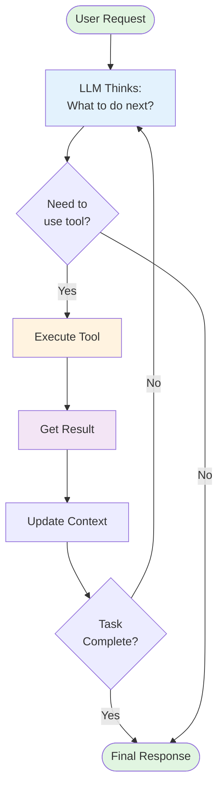

# Understanding Agent Loops: How AI Assistants Use Tools to Solve Complex Problems

## The "Magic" Behind Modern Coding Assistants

If you've used Claude Code, Cursor, Windsurf, Copilot, or any other modern AI coding assistant, you've probably noticed how they seem to "think" through problems systematically. They read your code, understand context, make targeted changes, and verify results—just like an experienced software engineer would. You might have wondered: _"What's the architecture that makes this multi-step reasoning possible?"_

Many software engineers think there's some incredibly complex magic happening inside these tools. Some revolutionary AI architecture that only a few companies have figured out. The reality? **They all operate on a surprisingly simple and elegant concept called agent loops.**

## About This Series

In this series, we'll dissect how coding agents actually work. We'll examine various implementations including **Claude Code**, RooCode, Aider, and other coding assistants, using real examples and open-source implementations where possible.

By understanding these patterns, we can:

- See how modern coding assistants really work
- Understand design decisions and trade-offs
- Learn how to build our own agents
- Use these tools more effectively in our daily work

In this post, I'm going to give you a quick intro to how modern coding assistants work. No marketing fluff, no hand-waving about "advanced AI"—just the core patterns that power every major AI coding tool today.

## The Simple Idea That Powers Everything

Picture this: You ask an AI assistant to "add error handling to all API endpoints." A simple chatbot would give you generic advice about try-catch blocks. But a modern AI agent? It actually reads your files, understands your code structure, modifies each endpoint, and verifies the changes make sense.

This is the power of **agent loops**—and it's transforming how AI assistants work.

## The Problem with One-Shot AI Responses

Traditional AI assistants work in a simple request-response pattern:

```
You: "Add error handling to my function"
AI: "Here's how to wrap code in try-catch blocks: [generic example]"
```

But real programming tasks aren't that simple. They require:

- **Finding** the right files
- **Understanding** the existing code
- **Making** appropriate changes
- **Verifying** nothing breaks

This is where agent loops come in—they give AI the ability to actually work through these steps, just like a software engineer would.

## What Is an Agent Loop?

An agent loop is an AI system that:

1. **Thinks** about what to do next
2. **Acts** by using a tool (read file, write file, etc.)
3. **Observes** the result
4. **Repeats** until the task is complete

Instead of giving you a one-time response, it actually works through the problem step by step, using tools to interact with your code.

### The Loop - The Orchestrator

The loop ties everything together. You can think about it as a simple while loop that continues until the task is complete, managing the flow between thinking (LLM) and doing (Tools).

Here's a visual representation of how the agent loop works:



And here's the same flow in code:

```typescript
while (!taskComplete) {
  // 1. Ask LLM what to do next
  const action = await llm.decideNextAction(context);
  
  // 2. Execute the tool if needed
  if (action.requiresTool) {
    const result = await executeTool(action);
    context = updateContext(context, result);
  }
  
  // 3. Check if task is complete
  taskComplete = action.isComplete;
}
```

That's it. The LLM decides, tools execute, the loop continues. This simple pattern creates systems that can solve complex, multi-step problems.

## Agent Loop Components

Let's break down the key components that make agent loops possible. Understanding these components reveals why modern coding assistants are so powerful.

### 1. The LLM (Large Language Model)

The LLM is the decision-maker. It understands your request, analyzes the current situation, and decides what to do next. Think of it as the brain that brings human-like reasoning to the loop.

### 2. Tools - The Agent's Hands

Tools give the agent the ability to interact with the external world. They're simple functions that perform specific actions and return results. The power comes from combining many tools to handle complex workflows.

**Common Tool Categories:**

**File System Operations:**

```typescript
// Reading files to understand code structure
readFile(path: string): Promise<string>

// Writing modified code back
writeFile(path: string, content: string): Promise<void>

// Discovering project structure
listDirectory(path: string, pattern?: string): Promise<string[]>

// Creating new files or directories
createFile(path: string, content: string): Promise<void>
deleteFile(path: string): Promise<void>
```

**Shell Command Execution:**

```typescript
// Running tests to verify changes
executeCommand(cmd: string): Promise<{ stdout: string, stderr: string }>
// Examples: "npm test", "python -m pytest", "cargo check"

// Building projects
runBuild(): Promise<BuildResult>

// Checking code quality
runLinter(files: string[]): Promise<LintResult>
```

**External Service Integration:**

```typescript
// Fetching design context from Figma
getFigmaDesign(fileId: string): Promise<{
  components: Component[],
  styles: StyleGuide,
  assets: Asset[]
}>

// Getting error context from crash reporting
getSentryIssues(projectId: string): Promise<{
  errors: CrashReport[],
  affectedUsers: number,
  stackTraces: StackTrace[]
}>

// Retrieving documentation
getConfluencePage(pageId: string): Promise<Documentation>

// Checking CI/CD status
getGitHubActions(repo: string): Promise<WorkflowRun[]>
```

The key is that tools are **composable**—an agent might read a Sentry crash report, find the problematic code file, read it, fix the issue, run tests, and create a PR, all by orchestrating these simple tools.

#### Implementation Approaches

There are multiple ways to make LLMs use tools, each with different trade-offs and compatibility requirements:

##### Provider-Specific Methods:

- **Anthropic's Tool Use**: Native function calling with structured schemas (as shown in our example)
- **OpenAI's Function Calling**: Similar structured approach with different API format
- **Google's Function Calling**: Gemini's implementation with its own conventions

##### Generic Methods:

- **XML Tags**: Using structured XML in prompts to indicate tool usage (`<tool_use>`, `<parameters>`)
- **JSON in Prompts**: Embedding tool calls as JSON objects within regular text
- **Natural Language**: Parsing tool requests from conversational text

##### Tool Execution Varies by Agent:

- **Claude Code**: Uses MCP servers and built-in tools like file operations, shell commands
- **Cursor**: Custom tool implementations with VS Code integration
- **Aider**: Git-focused tools with specialized diff and merge capabilities
- **Open Source Agents**: Often use LangChain, CrewAI, or custom tool frameworks

Each coding agent has evolved its own set of tools and execution methods, but they all follow the same fundamental agent loop pattern. The key is understanding that the loop itself is universal—it's the tool implementations and invocation methods that differ.

## The Real Source of Power

Understanding where the power in agent systems comes from requires a balanced perspective:

### The Model Provides the Intelligence

- **The Model Does the Heavy Lifting**: Modern LLMs like GPT-4, Claude, or Gemini already understand code, can reason about problems, and know how to decompose complex tasks
- **The Agent Loop is Surprisingly Simple**: At its core, it's just a while loop that lets the model use tools—the basic implementation can be done in a few hundred lines of code

### But Architecture Makes the Difference

While the model provides raw intelligence, **the agent architecture and implementation choices significantly impact real-world effectiveness**:

- **Tool Design Matters**: Well-designed tools with proper error handling, retry logic, and intelligent defaults make agents far more reliable
- **Context Management is Critical**: Smart context windowing, memory systems, and state management determine whether an agent can handle long, complex tasks
- **Execution Strategy**: Parallel tool execution, intelligent batching, and efficient planning can make agents 10x faster
- **Error Recovery**: Robust agents gracefully handle failures, retry intelligently, and know when to ask for help

This is why Claude Code, Cursor, and Windsurf can feel very different despite using similar models. The combination of a powerful model with thoughtful architecture creates the best experience.

In future articles in this series, we'll dive deeper into these architectural differences—exploring how different coding assistants implement context management, tool design, and execution strategies to create their unique experiences.

## Why Agent Loops Matter for Software Engineers

### 1. **Handling Complex, Multi-Step Problems**

Real development tasks rarely have simple solutions. Agent loops can tackle problems that require investigation, experimentation, and iteration.

### 2. **Contextual Understanding**

By using tools to explore the actual codebase, agents build deep contextual understanding rather than relying on generic knowledge.

### 3. **Verification and Validation**

Agents can verify their solutions actually work by running tests, checking types, and validating outputs.

### 4. **Adaptive Problem Solving**

When initial approaches fail, agents learn from the results and try different strategies.

### 5. **Automation of Tedious Tasks**

Tasks like large-scale refactoring, dependency updates, or documentation generation become manageable.

## Complete Example: Building an Agent Loop

Let's build a simple agent using Anthropic's SDK with proper tool use. This example shows exactly how agent loops work:

```typescript
import Anthropic from '@anthropic-ai/sdk';
import * as fs from 'fs/promises';
import * as path from 'path';

// Define our tools using Anthropic's tool format
// This is the "vocabulary" of actions our agent can perform
const tools = [
  {
    name: 'readFile',
    description: 'Read contents of a file',
    input_schema: {
      type: 'object',
      properties: {
        path: { type: 'string', description: 'Path to the file' },
      },
      required: ['path'],
    },
  },
  {
    name: 'writeFile',
    description: 'Write content to a file',
    input_schema: {
      type: 'object',
      properties: {
        path: { type: 'string', description: 'Path to the file' },
        content: { type: 'string', description: 'Content to write' },
      },
      required: ['path', 'content'],
    },
  },
  {
    name: 'listDirectory',
    description: 'List files in a directory',
    input_schema: {
      type: 'object',
      properties: {
        path: { type: 'string', description: 'Directory path' },
        pattern: { type: 'string', description: 'Optional filter pattern' },
      },
      required: ['path'],
    },
  },
] as const;

// Tool implementations - these are the actual functions that get called
// Each tool returns a result that gets fed back to the LLM
async function executeTool(toolName: string, params: any) {
  switch (toolName) {
    case 'readFile':
      // Read file content and return as string
      // This gives the LLM visibility into the current state of files
      return await fs.readFile(params.path, 'utf-8');

    case 'writeFile':
      // Write new content to file
      // This is how the LLM makes actual changes to the codebase
      await fs.writeFile(params.path, params.content);
      return `File ${params.path} updated successfully`;

    case 'listDirectory':
      // List files in directory, optionally filtered
      // This helps the LLM discover what files exist
      const files = await fs.readdir(params.path);
      if (params.pattern) {
        // Simple pattern matching - in real tools this would be more sophisticated
        return files.filter((f) => f.includes(params.pattern));
      }
      return files;

    default:
      throw new Error(`Unknown tool: ${toolName}`);
  }
}

// The agent loop - this is where the magic happens
async function runAgent(task: string) {
  // Initialize the Anthropic client
  const anthropic = new Anthropic({ apiKey: process.env.ANTHROPIC_API_KEY });

  // Message history - this maintains conversation context
  // Each tool result gets added here so the LLM can see what happened
  const messages = [];

  // Start the conversation with the user's task
  messages.push({
    role: 'user',
    content: task,
  });

  // Main agent loop - runs until task is complete or max steps reached
  // Step limit prevents infinite loops in case something goes wrong
  for (let step = 0; step < 10; step++) {
    console.log(`\nStep ${step + 1}:`);

    // THINK: Ask Claude what to do next
    // Claude analyzes the task, current context, and decides on next action
    const response = await anthropic.messages.create({
      model: 'claude-3-sonnet-20240229',
      messages: messages, // Conversation history
      tools: tools, // Available tools
      max_tokens: 1000,
    });

    // Add Claude's response to message history
    // This preserves the "thinking" for future steps
    messages.push(response);

    // ACT: Check if Claude wants to use a tool
    if (response.stop_reason === 'tool_use') {
      // Claude decided to use a tool rather than just respond
      const toolUse = response.content.find((c) => c.type === 'tool_use');

      if (toolUse) {
        console.log(`Using tool: ${toolUse.name}`);
        console.log(`Parameters: ${JSON.stringify(toolUse.input)}`);

        // Execute the requested tool
        try {
          // This is where the actual work happens
          const result = await executeTool(toolUse.name, toolUse.input);
          console.log(`Result: ${JSON.stringify(result).slice(0, 100)}...`);

          // OBSERVE: Add tool result back to conversation
          // This is crucial - the LLM needs to see what happened
          messages.push({
            role: 'user',
            content: [
              {
                type: 'tool_result',
                tool_use_id: toolUse.id,
                content: JSON.stringify(result),
              },
            ],
          });
        } catch (error) {
          // Handle tool errors gracefully
          // Even errors are valuable feedback for the LLM
          console.log(`Tool error: ${error.message}`);
          messages.push({
            role: 'user',
            content: [
              {
                type: 'tool_result',
                tool_use_id: toolUse.id,
                is_error: true,
                content: error.message,
              },
            ],
          });
        }
      }
    } else {
      // Claude is done - no more tools needed
      console.log('\n✓ Task completed!');
      console.log('Final response:', response.content[0].text);
      break;
    }

    // Loop continues - Claude will see the tool result and decide what to do next
    // This might be: use another tool, or conclude the task is complete
  }
}

// Example usage - this demonstrates the complete flow
await runAgent("Find all .js files in the src directory and add 'use strict' to the top of each file");

// What happens step by step:
// Step 1: Claude thinks "I need to see what files are in src/"
// Using tool: listDirectory
// Parameters: {"path": "src", "pattern": ".js"}
// Result: ["index.js", "utils.js", "config.js"]...
//
// Step 2: Claude thinks "I need to read the first file to see its current content"
// Using tool: readFile
// Parameters: {"path": "src/index.js"}
// Result: "const express = require('express');\n..."
//
// Step 3: Claude thinks "I need to add 'use strict' to the top"
// Using tool: writeFile
// Parameters: {"path": "src/index.js", "content": "'use strict';\nconst express = require('express');\n..."}
// Result: "File src/index.js updated successfully"
//
// [continues for each file...]
//
// ✓ Task completed!
// Final response: "I've successfully added 'use strict' to all 3 JavaScript files in the src directory."
```

That's it. This is the pattern behind every AI coding assistant. Claude decides what tool to use, executes it, sees the result, and continues until the task is done.

## Conclusion

Agent loops are the foundational pattern behind every modern AI coding assistant. By combining LLM intelligence with basic tools and an iterative loop, you get systems that can solve complex programming tasks.

Understanding this pattern helps you:

- Use these tools more effectively
- Debug when things go wrong
- Build your own specialized agents
- See through the marketing hype to understand real capabilities

In the next articles in this series, we'll dive deep into open source coding agents—examining implementations like Aider, Continue, and others where we can actually read the code. We'll explore how these agents organize their loops, design their tools, and implement the architectural choices that define their behavior. By focusing on open source solutions, we'll be able to look at real code, analyze design decisions, and truly understand the trade-offs each system makes.
