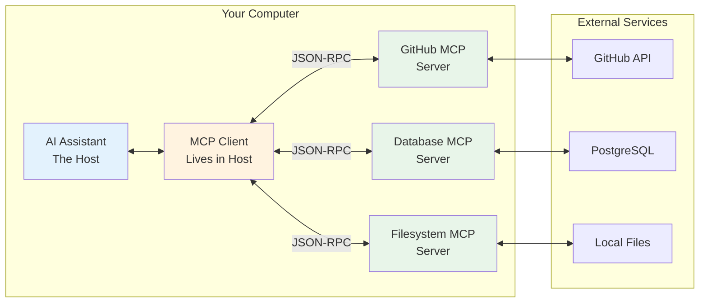

# Model Context Protocol: The USB-C Port for AI Coding Assistants

## Table of Contents

- [The Fragmented World of AI Tool Integration](#the-fragmented-world-of-ai-tool-integration)
- [The Integration Hell We've (Mostly) Solved](#the-integration-hell-weve-mostly-solved)
- [What Is MCP Really?](#what-is-mcp-really)
- [The Architecture: Simpler Than You Think](#the-architecture-simpler-than-you-think)
- [Tools, Resources, and Prompts: The Three Primitives](#tools-resources-and-prompts-the-three-primitives)
- [How MCP Powers Coding Agents](#how-mcp-powers-coding-agents)
- [Let's Build It: A Working MCP Server](#lets-build-it-a-working-mcp-server)
- [MCP in Action: Real Development Workflows](#mcp-in-action-real-development-workflows)
- [The Power of Standardization](#the-power-of-standardization)
- [The Reality: Schema Compatibility Headaches](#the-reality-schema-compatibility-headaches)
- [Practical Insights from the Trenches](#practical-insights-from-the-trenches)
- [The Future: Remote MCP and Beyond](#the-future-remote-mcp-and-beyond)
- [Conclusion](#conclusion)

## The Fragmented World of AI Tool Integration

If you've been using AI coding assistants—Claude Code, Cursor, Windsurf, Continue, Aider—you've probably noticed they all need to connect to the same tools. GitHub, your file system, databases, test runners. Each assistant reinvents these integrations. You might have wondered: _"Why does every AI assistant need its own GitHub plugin? Isn't this the same problem we solved with USB-C?"_

You're right. And in November 2024, Anthropic introduced Model Context Protocol (MCP) to solve exactly this problem.

Here's the thing: **MCP is just JSON-RPC with a standardized schema for tools.** That's it. No magic, no revolutionary architecture—just a well-designed protocol that's rapidly becoming the standard. OpenAI adopted it. Google DeepMind adopted it. The ecosystem is exploding.

In my [previous article about agent loops](loop.md), I showed you how AI coding assistants use a simple while loop to orchestrate LLMs and tools. Today, I'll show you how MCP standardizes those tools, turning them into pluggable, reusable components that any AI assistant can use.

## The Integration Hell We've (Mostly) Solved

Picture this scenario from just a year ago: I wanted my AI assistant to pull context from our Sentry crash reports while fixing bugs. Every tool needed its own custom integration. Different formats, different APIs, different authentication methods.

Today, in June 2025? **Most major AI coding assistants have converged on MCP.**

**The MCP Winners Circle:**
- **Claude Desktop & Claude Code**: First-class MCP support
- **Windsurf**: Simple MCP setup (takes minutes)
- **Cursor**: Full MCP support (though setup can be finicky)
- **Continue**: Open-source champion with MCP built-in
- **VS Code**: Agent mode with MCP for all users

**Still Holding Out:**
- **Aider**: Still using its own plugin system
- **Legacy enterprise tools**: Many internal tools haven't caught up
- **Some open-source projects**: Smaller projects still rolling their own

The transformation is remarkable. What used to be M×N integrations (M assistants × N tools) is rapidly becoming M+N. Build one MCP server for Sentry, and it works with Claude, Cursor, Windsurf, Continue—everywhere except the holdouts.

**MCP is winning because it solves a real problem.** As one developer put it: "If you're using Windsurf or Cursor without MCP, you're getting maybe 40% of what these tools can actually do."

## What Is MCP Really?

Let me demystify this: Model Context Protocol is an open standard that defines how AI applications connect to external tools and data sources. Think of it as **USB-C for AI assistants**.

Just like USB-C standardized how devices connect to peripherals, MCP standardizes how AI assistants connect to:
- Your codebase and file system
- External services (GitHub, Jira, Slack)
- Databases and APIs
- Development tools (linters, test runners, build systems)

**The core insight**: Instead of every AI assistant reinventing how to talk to GitHub, we define it once in MCP, and everyone benefits.

## The Architecture: Simpler Than You Think

Here's what's actually happening when you configure an MCP server:



**Three key components:**

1. **MCP Host** (Claude Desktop, ChatGPT, VS Code, any AI tool)
   - The application you interact with
   - Contains one or more MCP clients

2. **MCP Client** 
   - Lives inside the host
   - Maintains 1:1 connection with a server
   - Handles the JSON-RPC communication

3. **MCP Server**
   - Lightweight process exposing tools/resources
   - Can be written in any language
   - Connects to actual data sources

**The protocol itself?** JSON-RPC 2.0—the same battle-tested protocol used by Language Server Protocol (LSP). If you've used TypeScript in VS Code, you've already benefited from this approach.

## Tools, Resources, and Prompts: The Three Primitives

MCP defines three types of capabilities a server can expose. Understanding these is crucial for grasping how MCP enhances coding agents.

### 1. Tools: The Agent's Hands

Tools are functions the AI can invoke to perform actions. Sound familiar? These are exactly like the tools I showed in the agent loop article, but now standardized:

```typescript
// In your MCP server, you define tools like this:
{
  name: "create_github_issue",
  description: "Create a new issue in a GitHub repository",
  inputSchema: {
    type: "object",
    properties: {
      repo: { type: "string", description: "Repository (owner/name)" },
      title: { type: "string", description: "Issue title" },
      body: { type: "string", description: "Issue description" },
      labels: { 
        type: "array", 
        items: { type: "string" },
        description: "Labels to apply"
      }
    },
    required: ["repo", "title", "body"]
  }
}

// The AI uses it like any other tool in its loop:
// "I found a bug in the auth module. Let me create an issue for tracking."
// Tool: create_github_issue({ 
//   repo: "company/backend", 
//   title: "Auth token validation bypass",
//   body: "Details of the security issue...",
//   labels: ["bug", "security", "high-priority"]
// })
```

**Key insight**: Tools cause side effects—they change things in the world.

### 2. Resources: The Agent's Eyes

Resources are read-only data sources. They're like GET endpoints in a REST API:

```typescript
// Resource definition in your MCP server:
{
  uri: "sentry://issues/{project}",
  name: "Sentry crash reports",
  description: "Get recent crash reports from Sentry",
  mimeType: "application/json"
}

// When accessed, it returns data without side effects:
// AI: "Let me check recent crashes before implementing this fix"
// Resource: sentry://issues/backend
// Returns: {
//   "issues": [
//     {
//       "title": "TypeError: Cannot read property 'id' of null",
//       "count": 1247,
//       "lastSeen": "2024-11-15T10:30:00Z",
//       "stack": "at AuthService.validateToken (auth.js:45)..."
//     }
//   ]
// }
```

**The power**: Resources can be included in the AI's context automatically, giving it awareness of your system state.

### 3. Prompts: The Agent's Playbook

Prompts are reusable templates that combine tools and resources effectively:

```typescript
{
  name: "fix_sentry_issue",
  description: "Investigate and fix a Sentry crash report",
  arguments: [
    {
      name: "issue_id",
      description: "The Sentry issue ID to investigate",
      required: true
    }
  ],
  // The prompt template that gets expanded:
  template: `Investigate Sentry issue {{issue_id}}:
  
1. First, fetch the issue details from sentry://issues/{{project}}/{{issue_id}}
2. Analyze the stack trace to find the root cause
3. Use the search_codebase tool to find the problematic code
4. Read the relevant files with read_file tool
5. Implement a fix that handles the edge case
6. Write appropriate tests
7. Create a pull request with the fix

Focus on defensive programming to prevent similar issues.`
}
```

**Why this matters**: Prompts encode expertise. They're like giving your AI assistant a senior engineer's playbook.

## How MCP Powers Coding Agents

Remember the agent loop from my previous article? MCP supercharges it by making tools pluggable and shareable. Here's how they work together:

```typescript
// Before MCP: Tools hardcoded in your agent
const tools = [
  { name: 'readFile', fn: async (path) => fs.readFile(path) },
  { name: 'writeFile', fn: async (path, content) => fs.writeFile(path, content) },
  // Every tool manually implemented
];

// With MCP: Tools discovered dynamically
const mcpClient = await connectToMcpServer('github');
const availableTools = await mcpClient.listTools();
// Returns: ['create_issue', 'get_pr', 'merge_pr', 'run_workflow', ...]

// The agent loop stays the same, but now it can use ANY MCP tool:
while (taskNotComplete) {
  const action = await llm.decideNextAction(context, availableTools);
  
  if (action.tool.startsWith('github.')) {
    // Delegate to GitHub MCP server
    result = await mcpClient.callTool(action.tool, action.params);
  } else if (action.tool.startsWith('database.')) {
    // Delegate to Database MCP server
    result = await databaseMcp.callTool(action.tool, action.params);
  }
  // ... agent continues as before
}
```

**The game changer**: Your agent can now use tools it's never seen before. Install a new MCP server, and suddenly your AI can interact with Stripe, Figma, or your custom internal APIs.

## Let's Build It: A Working MCP Server

Let's build a real MCP server that exposes your test results to AI assistants. This example shows how simple MCP really is:

```typescript
import { Server } from '@modelcontextprotocol/sdk/server/index.js';
import { StdioServerTransport } from '@modelcontextprotocol/sdk/server/stdio.js';
import { exec } from 'child_process';
import { promisify } from 'util';

const execAsync = promisify(exec);

// Create an MCP server that exposes test-related functionality
class TestRunnerMCPServer {
  private server: Server;
  
  constructor() {
    // Initialize the MCP server - this handles all the protocol details
    this.server = new Server(
      {
        name: 'test-runner',
        version: '1.0.0',
      },
      {
        capabilities: {
          tools: {}, // We provide tools
          resources: {}, // We provide resources
        },
      }
    );
    
    this.setupHandlers();
  }
  
  private setupHandlers() {
    // Define available tools - these show up in the AI's tool list
    this.server.setRequestHandler('tools/list', async () => ({
      tools: [
        {
          name: 'run_tests',
          description: 'Run tests for a specific file or directory',
          inputSchema: {
            type: 'object',
            properties: {
              path: { 
                type: 'string', 
                description: 'File or directory to test' 
              },
              watch: { 
                type: 'boolean', 
                description: 'Run in watch mode',
                default: false
              },
            },
            required: ['path'],
          },
        },
        {
          name: 'run_specific_test',
          description: 'Run a specific test by name',
          inputSchema: {
            type: 'object',
            properties: {
              file: { type: 'string', description: 'Test file path' },
              testName: { type: 'string', description: 'Specific test name to run' },
            },
            required: ['file', 'testName'],
          },
        },
      ],
    }));
    
    // Handle tool execution - this is where the actual work happens
    this.server.setRequestHandler('tools/call', async (request) => {
      const { name, arguments: args } = request.params;
      
      switch (name) {
        case 'run_tests': {
          // Run the test command (npm test, pytest, etc. based on project)
          const testCommand = await this.detectTestCommand();
          const { stdout, stderr } = await execAsync(
            `${testCommand} ${args.path} ${args.watch ? '--watch' : ''}`
          );
          
          // Parse test results to structured format
          const results = this.parseTestOutput(stdout);
          
          return {
            content: [
              {
                type: 'text',
                text: `Ran ${results.total} tests: ${results.passed} passed, ${results.failed} failed`,
              },
              {
                type: 'text', 
                text: stdout, // Full output for context
              },
            ],
          };
        }
        
        case 'run_specific_test': {
          // Many test runners support running specific tests
          const { stdout } = await execAsync(
            `npm test -- ${args.file} -t "${args.testName}"`
          );
          
          return {
            content: [{
              type: 'text',
              text: stdout,
            }],
          };
        }
        
        default:
          throw new Error(`Unknown tool: ${name}`);
      }
    });
    
    // Define available resources - these provide read-only data
    this.server.setRequestHandler('resources/list', async () => ({
      resources: [
        {
          uri: 'test://results/latest',
          name: 'Latest test results',
          description: 'Most recent test run results',
          mimeType: 'application/json',
        },
        {
          uri: 'test://coverage',
          name: 'Code coverage report',
          description: 'Current code coverage statistics',
          mimeType: 'application/json',
        },
      ],
    }));
    
    // Handle resource reads
    this.server.setRequestHandler('resources/read', async (request) => {
      const { uri } = request.params;
      
      switch (uri) {
        case 'test://results/latest': {
          // Read cached test results or run tests to get them
          const results = await this.getLatestTestResults();
          return {
            contents: [{
              uri,
              mimeType: 'application/json',
              text: JSON.stringify(results, null, 2),
            }],
          };
        }
        
        case 'test://coverage': {
          // Read coverage data (e.g., from coverage/lcov-report)
          const coverage = await this.getCoverageData();
          return {
            contents: [{
              uri,
              mimeType: 'application/json', 
              text: JSON.stringify(coverage, null, 2),
            }],
          };
        }
        
        default:
          throw new Error(`Unknown resource: ${uri}`);
      }
    });
  }
  
  private async detectTestCommand(): Promise<string> {
    // Smart detection of test command based on project type
    // This is what makes the MCP server intelligent
    try {
      await execAsync('npm test --version');
      return 'npm test';
    } catch {
      try {
        await execAsync('pytest --version');
        return 'pytest';
      } catch {
        return 'cargo test'; // Fallback for Rust projects
      }
    }
  }
  
  private parseTestOutput(output: string): TestResults {
    // Parse test runner output into structured data
    // Real implementation would handle different test runner formats
    const passedMatch = output.match(/(\d+) passed/);
    const failedMatch = output.match(/(\d+) failed/);
    
    return {
      passed: passedMatch ? parseInt(passedMatch[1]) : 0,
      failed: failedMatch ? parseInt(failedMatch[1]) : 0,
      total: 0, // Would calculate from output
    };
  }
  
  async start() {
    // Use stdio transport - this is how Claude Code communicates
    const transport = new StdioServerTransport();
    await this.server.connect(transport);
    console.error('Test Runner MCP Server running on stdio');
  }
}

// Start the server
const server = new TestRunnerMCPServer();
server.start().catch(console.error);
```

Now let's configure different AI assistants to use our server:

```json
// Claude Desktop: ~/.claude/claude_desktop_config.json
{
  "mcpServers": {
    "test-runner": {
      "command": "node",
      "args": ["/path/to/test-runner-mcp.js"],
      "env": {
        "NODE_ENV": "development"
      }
    }
  }
}

// ChatGPT Desktop: Similar JSON configuration
// VS Code: Added through settings or extension
// Custom agents: Use the MCP SDK to connect
```

**That's it.** Your AI assistant can now:
- Run your tests with understanding of the project structure
- Analyze test failures and suggest fixes
- Monitor coverage while implementing features
- Run specific tests when debugging

## MCP in Action: Real Development Workflows

Let me show you how MCP transforms real development workflows across different AI assistants. Here's what happens when you ask your AI to "Fix the failing auth tests and improve coverage":

```typescript
// You: "Fix the failing auth tests and improve coverage"

// The AI's internal process using MCP tools:

// Step 1: Check current test status
Tool: test-runner.run_tests({ path: "src/auth" })
// Result: "3 passed, 2 failed"
// Failed: "AuthService › validateToken › should reject expired tokens"
// Failed: "AuthService › refreshToken › should handle network errors"

// Step 2: Get coverage data
Resource: test://coverage
// Result: { 
//   "src/auth/auth-service.ts": { "lines": 72.5, "branches": 60.0 },
//   "uncovered_lines": [45, 46, 78-82, 95]
// }

// Step 3: Read the failing test
Tool: filesystem.read_file({ path: "src/auth/auth-service.test.ts" })
// Sees the test expecting specific error handling

// Step 4: Read the implementation
Tool: filesystem.read_file({ path: "src/auth/auth-service.ts" })
// Notices missing error handling for network timeouts

// Step 5: Fix the implementation
Tool: filesystem.write_file({
  path: "src/auth/auth-service.ts",
  content: "// Updated validateToken with timeout handling..."
})

// Step 6: Run specific failing test to verify
Tool: test-runner.run_specific_test({
  file: "src/auth/auth-service.test.ts",
  testName: "should reject expired tokens"
})
// Result: "PASS"

// Step 7: Add tests for uncovered lines
Tool: filesystem.write_file({
  path: "src/auth/auth-service.test.ts", 
  content: "// New tests for error edge cases..."
})

// Step 8: Run all tests and check coverage
Tool: test-runner.run_tests({ path: "src/auth" })
// Result: "5 passed, 0 failed"
Resource: test://coverage
// Result: { "src/auth/auth-service.ts": { "lines": 95.0, "branches": 88.0 } }

// AI: "I've fixed both failing auth tests and improved coverage from 72.5% to 95%."
```

**The key insight**: MCP servers provide domain-specific intelligence. The test runner MCP knows about different test frameworks, coverage tools, and test patterns. The AI assistant—whether it's Claude, ChatGPT, or your custom agent—just orchestrates.

## The Power of Standardization

Here's where MCP shines. That test runner server I just showed you? It works with:

- **Claude Desktop**: Configure in claude_desktop_config.json
- **ChatGPT Desktop**: Configure in their MCP settings
- **VS Code Copilot**: Add to Copilot configuration
- **Continue.dev**: Use their MCP adapter
- **Your custom agent**: Connect via the MCP client SDKs

Write once, use everywhere. **This is the USB-C moment for AI tools.**

Even better, the ecosystem is exploding:

```typescript
// Install pre-built MCP servers with one command:
npx @modelcontextprotocol/server-github  // GitHub integration
npx @modelcontextprotocol/server-gitlab  // GitLab integration  
npx @modelcontextprotocol/server-postgres // Direct DB access
npx @modelcontextprotocol/server-stripe  // Stripe API access
npx @modelcontextprotocol/server-sentry  // Error tracking
uvx mcp-server-docker                    // Docker management
```

Each server is a focused, reusable component. Compose them together, and your AI assistant becomes incredibly powerful.

## The Reality: Schema Compatibility Headaches

But here's the dirty secret nobody talks about: **MCP isn't as universal as we'd like.** Different providers have different levels of JSON Schema support, and what works perfectly with one AI assistant might completely break with another.

I learned this the hard way last week. Built a beautiful MCP server for our deployment system. Worked flawlessly with Claude. Moved it to ChatGPT—half the tools failed. The problem? Schema complexity.

### What Works Everywhere

Simple, flat schemas work across all providers:

```typescript
// This works everywhere - simple and flat
{
  name: "read_file",
  inputSchema: {
    type: "object",
    properties: {
      path: { type: "string", description: "File path" },
      encoding: { type: "string", default: "utf-8" }
    },
    required: ["path"]
  }
}
```

### What Breaks Things

But try something more sophisticated, and you'll hit walls:

```typescript
// This might work with Claude but fail elsewhere
{
  name: "complex_search",
  inputSchema: {
    type: "object",
    properties: {
      filters: {
        type: "array",
        items: {
          type: "object",
          properties: {
            field: { 
              type: "string", 
              enum: ["status", "priority", "assignee"] 
            },
            operator: { 
              type: "string", 
              pattern: "^(eq|ne|gt|lt|contains)$" 
            },
            value: { 
              oneOf: [
                { type: "string" },
                { type: "number" },
                { type: "boolean" }
              ]
            }
          },
          required: ["field", "operator", "value"]
        },
        minItems: 1,
        maxItems: 10
      },
      sort: {
        type: "object",
        properties: {
          field: { type: "string" },
          direction: { type: "string", enum: ["asc", "desc"] }
        }
      }
    }
  }
}
```

**Common compatibility killers:**
- `oneOf`, `anyOf`, `allOf` constructs
- Complex nested objects with validation
- Arrays of objects with required fields
- Regular expression patterns
- Conditional schemas

### Why This Happens

The root cause? Different LLMs have different capabilities:

1. **Claude**: Handles complex schemas well, strong at maintaining structure
2. **GPT-4**: Good with most schemas, struggles with deep nesting
3. **Open source models**: Often need very simple schemas
4. **Custom agents**: Depends entirely on implementation

It's not that MCP is broken—it's that providers implement different subsets of JSON Schema based on their model capabilities.

### Building Compatible MCP Servers

Here's how I've learned to build MCP servers that actually work everywhere:

```typescript
// Instead of complex nested schemas, flatten them:
{
  name: "search_with_filter",
  inputSchema: {
    type: "object",
    properties: {
      // Instead of array of filter objects, use parallel arrays
      filterFields: { 
        type: "array", 
        items: { type: "string" },
        description: "Fields to filter on"
      },
      filterOperators: { 
        type: "array", 
        items: { type: "string" },
        description: "Operators (eq, ne, gt, lt)"
      },
      filterValues: { 
        type: "array", 
        items: { type: "string" },
        description: "Values to filter for"
      },
      // Simple, flat structure
      sortField: { type: "string" },
      sortDirection: { type: "string" }
    }
  }
}
```

**Best practices for compatibility:**

1. **Test across providers**: Don't assume Claude compatibility means universal compatibility
2. **Provide fallbacks**: Offer both simple and complex versions of tools
3. **Document limitations**: Be explicit about which providers you've tested
4. **Use the simplest schema possible**: If it can be a string, make it a string
5. **Avoid nested arrays**: They're compatibility nightmares

### The Path Forward

The good news? This is improving rapidly. OpenAI and Anthropic are converging on schema support. The MCP specification is evolving. Community efforts are documenting compatibility matrices.

But for now, if you want your MCP server to work everywhere, **keep it simple**. The fancier your schema, the smaller your compatibility pool.

## Practical Insights from the Trenches

After building several MCP servers and using them in production, here's what I've learned:

### 1. **Keep Servers Focused**

Build single-purpose MCP servers. Instead of one mega-server that does everything, create:
- `mcp-test-runner` for test execution
- `mcp-coverage` for coverage analysis  
- `mcp-benchmark` for performance testing

**Why?** Easier to maintain, debug, and share with others.

### 2. **Resources vs Tools: Get It Right**

- **Resources**: Reading state, gathering context, no side effects
- **Tools**: Taking actions, changing things, has side effects

Getting this wrong makes your AI assistant unpredictable.

### 3. **Transport Matters**

- **stdio**: Perfect for local tools, fast, simple
- **HTTP+SSE**: Required for remote servers, adds latency
- **Coming soon**: WebSocket transport for real-time updates

For coding tools, stdio is almost always the right choice.

### 4. **Error Handling Is Critical**

```typescript
// Bad: Crashes break the AI's flow
const result = await execAsync(command);

// Good: Graceful degradation
try {
  const result = await execAsync(command);
  return { success: true, output: result.stdout };
} catch (error) {
  return { 
    success: false, 
    error: error.message,
    suggestion: "Try running 'npm install' first"
  };
}
```

Your MCP server errors become the AI's learning opportunities.

### 5. **Performance Tricks**

- Cache resource reads aggressively
- Batch tool operations when possible
- Use streaming for large outputs
- Implement progress reporting for long operations

Remember: The AI is patient, but users aren't.

## The Future: Remote MCP and Beyond

Right now, MCP servers run locally. But the future is remote MCP servers—imagine:

```typescript
// Future: Connect to remote MCP servers
{
  "mcpServers": {
    "company-api": {
      "url": "https://mcp.company.com/api",
      "auth": { "type": "oauth2", "token": "..." }
    },
    "production-db": {
      "url": "mcp://db.company.com:5432",
      "auth": { "type": "mtls" }
    }
  }
}
```

**Why this matters**: 
- Shared team resources without local setup
- Secure access to production systems
- Centralized tool management
- Cloud-based AI agents that work like local ones

Companies like Cloudflare are already building infrastructure for this. Soon, connecting to your company's internal tools will be as easy as installing an npm package.

## Conclusion

Model Context Protocol is the missing piece that turns agent loops into production-ready systems. By standardizing how AI assistants connect to tools and data, MCP enables the composable, pluggable architecture that makes modern coding assistants so powerful.

**The key takeaways:**

1. **MCP is just JSON-RPC with conventions**—no magic, just good engineering
2. **Tools, Resources, and Prompts** are the three primitives that enable rich interactions
3. **Write once, use everywhere**—one MCP server works with all compatible AI assistants
4. **The ecosystem is young but growing fast**—this is the perfect time to build

Remember my agent loop article? MCP is what makes those tools pluggable and shareable. Instead of every agent implementing file reading differently, they all use the same MCP filesystem server. **That's the power of standards.**

In my next article, I'll dive deep into Claude Code's architecture—how it uses MCP servers, manages context windows, and implements those smooth multi-file edits you've come to love. We'll peek under the hood and see how the sausage is made.

Until then, try building your own MCP server. Pick a tool you use daily—your test runner, linter, or deployment system—and expose it via MCP. You'll be surprised how simple it is, and how powerful your AI assistant becomes when it can use your tools as naturally as you do.

*Want to explore more? Check out the [MCP specification](https://modelcontextprotocol.io), browse [available servers](https://github.com/modelcontextprotocol/servers), or join the community building this ecosystem.*