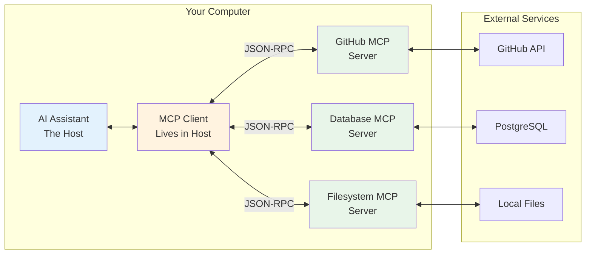

# MCP Solved Nuclear Fusion

## Table of Contents

- [The Hype vs Reality](#the-hype-vs-reality)
- [The Integration Hell We've (Mostly) Solved](#the-integration-hell-weve-mostly-solved)
- [What Is MCP Really?](#what-is-mcp-really)
- [The Architecture: Simpler Than You Think](#the-architecture-simpler-than-you-think)
- [Tools, Resources, and Prompts: The Three Primitives](#tools-resources-and-prompts-the-three-primitives)
- [How MCP Powers Coding Agents](#how-mcp-powers-coding-agents)
- [Let's Build It: A Working MCP Server](#lets-build-it-a-working-mcp-server)
- [MCP in Action: Real Development Workflows](#mcp-in-action-real-development-workflows)
- [The Power of Standardization](#the-power-of-standardization)
- [Can This USB-C Cable Charge My Phone?](#can-this-usb-c-cable-charge-my-phone)
- [Practical Insights from the Trenches](#practical-insights-from-the-trenches)
- [The Future: Remote MCP and Beyond](#the-future-remote-mcp-and-beyond)
- [Conclusion](#conclusion)

## The Hype vs Reality

If you've been on r/mcp lately, you'd think we've discovered fire. Every other post is about how MCP is a "game changer," a "paradigm shift," or my personal favorite—"the future of human-computer interaction."

The breathless blog posts. The YouTube videos with shocked-face thumbnails. The LinkedIn thought leaders declaring it'll transform everything we know about software development. I'm half expecting someone to claim MCP can solve climate change next.

Come on.

**Here's what MCP actually is: JSON-RPC with a standardized schema for tools.** That's it. It's not revolutionary AI architecture. It's not a breakthrough in machine learning. It's a well-designed protocol that solves a very specific problem: every AI assistant was reinventing the same damn GitHub integration.

But here's the thing—sometimes boring solutions to real problems are exactly what we need. USB-C isn't revolutionary technology either, but I'm sure glad I don't need seventeen different chargers anymore.

**TL;DR:** MCP is just a standardized way to register and call tools from external processes. Your AI assistant (the host) connects to MCP servers (separate processes) that expose tools like "read_file" or "query_database". Instead of hardcoding these tools into every AI assistant, MCP lets any assistant discover and use tools from any MCP server via JSON-RPC. Think USB-C for AI tools. If you're building tools for AI assistants, you should probably support it. If you're using AI assistants without MCP, you're missing out on a lot of functionality.

## The Integration Hell We've (Mostly) Solved

Picture this scenario from just a year ago: I wanted my AI assistant to pull context from our Sentry crash reports while fixing bugs. Every tool needed its own custom integration. Different formats, different APIs, different authentication methods.

Today, in June 2025? **Most major AI coding assistants have converged on MCP.**

**The MCP Winners Circle:**

- **Claude Desktop & Claude Code**: First-class MCP support
- **Windsurf**: Simple MCP setup (takes minutes)
- **Cursor**: Full MCP support (though setup can be finicky)
- **Continue**: Open-source champion with MCP built-in
- **VS Code**: Agent mode with MCP for all users

**Still Holding Out:**

- **Aider**: Still using its own plugin system
- **Legacy enterprise tools**: Many internal tools haven't caught up
- **Some open-source projects**: Smaller projects still rolling their own

The transformation is remarkable. What used to be M×N integrations (M assistants × N tools) is rapidly becoming M+N. Build one MCP server for Sentry, and it works with Claude, Cursor, Windsurf, Continue—everywhere except the holdouts.

**MCP is winning because it solves a real problem.** As one developer put it: "If you're using Windsurf or Cursor without MCP, you're getting maybe 40% of what these tools can actually do."

## What Is MCP Really?

Model Context Protocol is an open standard that defines how AI applications connect to external tools and data sources. Think of it as the standardized interface for AI assistants—like how USB standardized peripheral connections.

MCP standardizes how AI assistants connect to:

- Your codebase and file system
- External services (GitHub, Jira, Slack)
- Databases and APIs
- Development tools (linters, test runners, build systems)

**The core insight**: Instead of every AI assistant reinventing how to talk to GitHub, we define it once in MCP, and everyone benefits.

## The Architecture: Simpler Than You Think

Here's what's actually happening when you configure an MCP server:



**Three key components:**

1. **MCP Host** (Claude Desktop, ChatGPT, VS Code, any AI tool)

   - The application you interact with
   - Contains one or more MCP clients

2. **MCP Client**

   - Lives inside the host
   - Maintains 1:1 connection with a server
   - Handles the JSON-RPC communication

3. **MCP Server**
   - Lightweight process exposing tools/resources
   - Can be written in any language
   - Connects to actual data sources

**The protocol itself?** JSON-RPC 2.0—the same battle-tested protocol used by Language Server Protocol (LSP). If you've used TypeScript in VS Code, you've already benefited from this approach.

## Tools, Resources, and Prompts: The Three Primitives

MCP defines three types of capabilities a server can expose. For coding agents, you'll use tools 98% of the time—they're what actually get work done.

### 1. Tools: Functions That Do Things

Tools are functions the AI can invoke to perform actions. Sound familiar? These are exactly like the tools I showed in the agent loop article, but now standardized:

```typescript
// In your MCP server, you define tools like this:
{
  name: "create_github_issue",
  description: "Create a new issue in a GitHub repository",
  inputSchema: {
    type: "object",
    properties: {
      repo: { type: "string", description: "Repository (owner/name)" },
      title: { type: "string", description: "Issue title" },
      body: { type: "string", description: "Issue description" },
      labels: {
        type: "array",
        items: { type: "string" },
        description: "Labels to apply"
      }
    },
    required: ["repo", "title", "body"]
  }
}

// The AI uses it like any other tool in its loop:
// "I found a bug in the auth module. Let me create an issue for tracking."
// Tool: create_github_issue({
//   repo: "company/backend",
//   title: "Auth token validation bypass",
//   body: "Details of the security issue...",
//   labels: ["bug", "security", "high-priority"]
// })
```

**Key insight**: Tools cause side effects—they change things in the world.

### 2. Resources: Read-Only Data Sources

Resources are read-only data sources. They're like GET endpoints in a REST API:

```typescript
// Resource definition in your MCP server:
{
  uri: "sentry://issues/{project}",
  name: "Sentry crash reports",
  description: "Get recent crash reports from Sentry",
  mimeType: "application/json"
}

// When accessed, it returns data without side effects:
// AI: "Let me check recent crashes before implementing this fix"
// Resource: sentry://issues/backend
// Returns: {
//   "issues": [
//     {
//       "title": "TypeError: Cannot read property 'id' of null",
//       "count": 1247,
//       "lastSeen": "recently",
//       "stack": "at AuthService.validateToken (auth.js:45)..."
//     }
//   ]
// }
```

**The power**: Resources can be included in the AI's context automatically, giving it awareness of your system state.

### 3. Prompts: Reusable Templates

Prompts are pre-defined templates that combine tools and resources effectively:

```typescript
{
  name: "fix_sentry_issue",
  description: "Investigate and fix a Sentry crash report",
  arguments: [
    {
      name: "issue_id",
      description: "The Sentry issue ID to investigate",
      required: true
    }
  ],
  // The prompt template that gets expanded:
  template: `Investigate Sentry issue {{issue_id}}:

1. First, fetch the issue details from sentry://issues/{{project}}/{{issue_id}}
2. Analyze the stack trace to find the root cause
3. Use the search_codebase tool to find the problematic code
4. Read the relevant files with read_file tool
5. Implement a fix that handles the edge case
6. Write appropriate tests
7. Create a pull request with the fix

Focus on defensive programming to prevent similar issues.`
}
```

**Why this matters**: Prompts encode expertise. They're like giving your AI assistant a senior engineer's playbook.

## How MCP Powers Coding Agents

Remember the agent loop from my previous article? MCP extends it by making tools pluggable and shareable. Here's how they work together:

```typescript
// Before MCP: Tools hardcoded in your agent
const tools = [
  { name: 'readFile', fn: async (path) => fs.readFile(path) },
  { name: 'writeFile', fn: async (path, content) => fs.writeFile(path, content) },
  // Every tool manually implemented
];

// With MCP: Tools discovered dynamically
const mcpClient = await connectToMcpServer('github');
const availableTools = await mcpClient.listTools();
// Returns: ['create_issue', 'get_pr', 'merge_pr', 'run_workflow', ...]

// The agent loop stays the same, but now it can use ANY MCP tool:
while (taskNotComplete) {
  const action = await llm.decideNextAction(context, availableTools);

  if (action.tool.startsWith('github.')) {
    // Delegate to GitHub MCP server
    result = await mcpClient.callTool(action.tool, action.params);
  } else if (action.tool.startsWith('database.')) {
    // Delegate to Database MCP server
    result = await databaseMcp.callTool(action.tool, action.params);
  }
  // ... agent continues as before
}
```

**The key difference**: Your agent can now use tools it's never seen before. Install a new MCP server, and suddenly your AI can interact with Stripe, Figma, or your custom internal APIs.

## Let's Build It: A Working MCP Server

Let's build the simplest possible MCP server—one that tells the current time:

```typescript
import { Server } from '@modelcontextprotocol/sdk/server/index.js';
import { StdioServerTransport } from '@modelcontextprotocol/sdk/server/stdio.js';

const server = new Server({ name: 'time-server', version: '1.0.0' }, { capabilities: { tools: {} } });

// Define and implement a tool in one go
server.tool(
  'get_current_time',
  'Get the current time in any timezone',
  {
    timezone: {
      type: 'string',
      description: 'Timezone (e.g., "UTC", "America/New_York")',
      required: true,
    },
  },
  async ({ timezone }) => {
    const time = new Date().toLocaleString('en-US', {
      timeZone: timezone,
      dateStyle: 'full',
      timeStyle: 'long',
    });

    return {
      content: [
        {
          type: 'text',
          text: `Current time in ${timezone}: ${time}`,
        },
      ],
    };
  }
);

// Start the server
const transport = new StdioServerTransport();
await server.connect(transport);
```

Configure it in your AI assistant:

```json
// Example configuration
{
  "mcpServers": {
    "time-server": {
      "command": "node",
      "args": ["/path/to/time-server.js"]
    }
  }
}
```

**That's it.** In ~20 lines, you've built an MCP server. The `server.tool()` helper handles all the protocol details. Your AI assistant can now ask for the time in any timezone—and more importantly, you understand the pattern for building any MCP server.

## MCP in Action: Real Development Workflows

Let me show you how MCP transforms real development workflows. Here's what happens when you ask your AI to "Fix the failing auth tests":

```typescript
// You: "Fix the failing auth tests"

// The AI's internal process using MCP tools:

// Step 1: Check current test status
Tool: test - runner.run_tests({ path: 'src/auth' });
// Result: "3 passed, 2 failed"

// Step 2: Read the failing test
Tool: filesystem.read_file({ path: 'src/auth/auth-service.test.ts' });
// Sees the test expecting specific error handling

// Step 3: Read the implementation
Tool: filesystem.read_file({ path: 'src/auth/auth-service.ts' });
// Notices missing error handling

// Step 4: Fix the implementation
Tool: filesystem.write_file({
  path: 'src/auth/auth-service.ts',
  content: '// Updated with proper error handling...',
});

// Step 5: Verify the fix
Tool: test - runner.run_tests({ path: 'src/auth' });
// Result: "5 passed, 0 failed"

// AI: "I've fixed the failing auth tests by adding proper error handling for network timeouts."
```

**The key insight**: MCP servers provide domain-specific intelligence. The test runner MCP knows about test frameworks. The filesystem MCP handles file operations. The AI orchestrates them to solve your problem.

## The Power of Standardization

Here's where MCP shines. That test runner server I just showed you? It works with:

- **Claude Desktop**: Configure in claude_desktop_config.json
- **ChatGPT Desktop**: Configure in their MCP settings
- **VS Code Copilot**: Add to Copilot configuration
- **Continue.dev**: Use their MCP adapter
- **Your custom agent**: Connect via the MCP client SDKs

Write once, use everywhere.

Even better, the ecosystem is exploding. Check out [awesome-mcp-servers](https://github.com/punkpeye/awesome-mcp-servers) for a curated list of available servers—from GitHub integration to database access to LLM tools..

Each server is a focused, reusable component. Compose them together, and your AI assistant becomes more capable.

## Can This USB-C Cable Charge My Phone?

Remember when USB-C was supposed to solve all our cable problems? One cable for everything! Then you discovered your USB-C cable charges your laptop but not your phone. Or transfers data but won't output video. Or works with everything except that one device.

MCP has the same problem.

### Schema Compatibility Issues

Different providers support different parts of JSON Schema. What works with one AI assistant might fail with another.

**What works everywhere:**

```typescript
// Simple, flat schemas
{
  name: "read_file",
  inputSchema: {
    type: "object",
    properties: {
      path: { type: "string", description: "File path" }
    },
    required: ["path"]
  }
}
```

**What might break:**

- Complex nested objects
- `oneOf`, `anyOf`, `allOf` constructs
- Arrays of objects with validation
- Regular expression patterns

**The root cause?** Each provider—Claude, OpenAI, Gemini—implements their own subset of JSON Schema. There's no official compatibility matrix.

### Ecosystem Challenges

**Discovery is broken.** Need an MCP server for Jira? You're searching GitHub and hoping. There's no central registry, no package manager for MCP servers.

**Zero quality control.** Found an MCP server? Is it secure? Does it work? When was it last updated? You're running code with full tool access—that's a trust exercise.

**Security is on you.** MCP servers have whatever access you give them. That random GitHub server you're about to install? It could read your SSH keys, access your AWS credentials, or delete your files. Smart developers run MCP servers in Docker containers:

```bash
# Better safe than sorry
docker run --rm -it \
  --mount type=bind,source=/safe/path,target=/data \
  some-mcp-server
```

But most people don't. They run MCP servers directly, with full system access. That's the reality.

**Configuration fragmentation.** The same MCP server needs different configuration for each host. MCP standardized the protocol but not the configuration.

### The Bottom Line

MCP works. The protocol is solid. But the ecosystem is immature. If you're building on MCP today, you need to:

- Test across multiple providers
- Keep schemas simple
- Vet servers carefully
- Accept some rough edges

## Practical Insights from the Trenches

After building several MCP servers, here's what actually matters:

### 1. **Keep Servers Focused**

One tool, one server. Don't build kitchen sinks.

- `mcp-test-runner` for tests
- `mcp-linter` for linting
- `mcp-deploy` for deployments

### 2. **Resources vs Tools**

- **Resources**: Read-only, no side effects (GET)
- **Tools**: Take actions, change things (POST/PUT/DELETE)

Get this wrong and your AI becomes unpredictable.

### 3. **Error Handling Matters**

```typescript
// Good: Errors help the AI learn
try {
  const result = await execAsync(command);
  return { success: true, output: result.stdout };
} catch (error) {
  return {
    success: false,
    error: error.message,
    suggestion: 'Check if dependencies are installed',
  };
}
```

### 4. **Tool Names and Descriptions Are Everything**

This is critical: your tool names and descriptions are the API documentation for the AI. You need the same discipline you'd use with native function calling, but now it's harder—your tools might be used by Claude, GPT-4, or some open source model.

```typescript
// Bad: Vague and ambiguous
server.tool('run', 'Run something', ...)

// Good: Clear and specific
server.tool(
  'execute_unit_tests',
  'Run unit tests for specified file or directory. Returns test results with pass/fail counts and failure details.',
  ...
)
```

The AI can only use tools it understands. Since different models interpret descriptions differently, be explicit. What works as a terse description for Claude might confuse GPT-4.

## The Future: Remote MCP and Beyond

Right now, MCP servers run locally. The future? Remote servers:

```typescript
// Coming soon
{
  "mcpServers": {
    "company-api": {
      "url": "https://mcp.company.com/api",
      "auth": { "type": "oauth2" }
    }
  }
}
```

This enables:

- Shared team resources
- Secure production access
- Centralized management
- Cloud-based agents

## Conclusion

Model Context Protocol is the missing piece that makes agent loops practical. By standardizing tool integration, MCP turns the M×N problem into M+N.

**Key takeaways:**

1. **MCP is just JSON-RPC with conventions**—no magic
2. **Tools, Resources, and Prompts** enable rich AI interactions
3. **Write once, use everywhere**—mostly
4. **The ecosystem needs work** but it's improving fast

Remember my agent loop article? MCP makes those tools pluggable and shareable. Instead of every agent reimplementing everything, we build once and share.

Try building an MCP server for your daily tools. You'll be surprised how simple it is—and how much more your AI assistant can do when it speaks your tools' language.

_Want to explore more? Check out the [MCP specification](https://modelcontextprotocol.io), browse [available servers](https://github.com/punkpeye/awesome-mcp-servers), or build your own._
